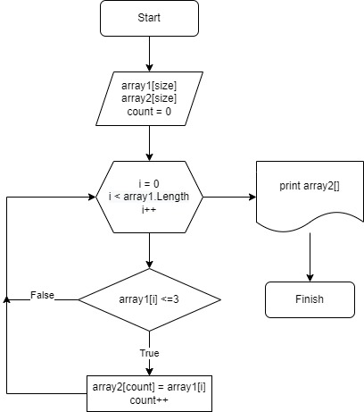

Итоговый проект по теме "Язык программирования C#"

**Задача**: Написать программу, которая из имеющегося массива строк сформирует массив из строк, длина которых меньше либо равна 3 символам. Первоначальный массив можно ввести с клавиатуры, либо задать на старте выполнения алгоритма. При решении не рекомендуется пользоваться коллекциями, лучше обойтись исключительно массивами.

*Алгоритм решения:*

1. Создаю метод, который принимает на вход массив. Внутри метода создаем массив, равный по длине входящему масссиву. 

2. Создаем цикл, который переберет входящий массив

3. Проверяем каждый элемент масива на условие задачи: элемент меньше либо равен 3. Все элементы, подходящие под условие записываем в новый массив.

